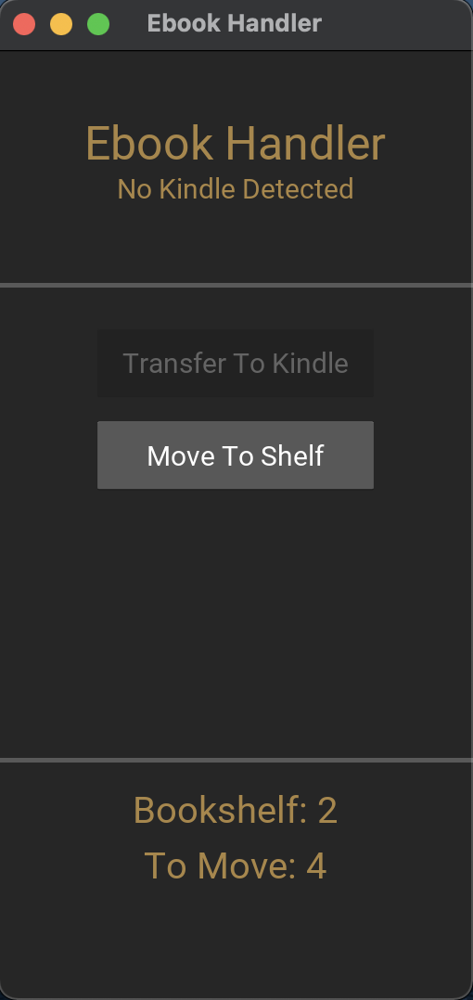

# EBookAutomator
Ebook handler is a simple python program that will move your recently
downloaded ebooks from ```~/Downloads/``` to ```~/bookshelf/```. The program
can also move over all of the books that you have stored locally to your kindle.
This feature is currently only supported for the ```macos``` file-system.

## GUI or Console

The ebook handler is usable both by gui and terminal. The terminal commands are
listed under the ```Commands``` sub-chapter.

The GUI is a light weight gui environment developed with kivy. If for some
reason you can use it then make sure kivy is installed?

If you haven't connected the kindle and you want to use the gui application
then go ahead, you can connect it during runtime.

### Commands
* ```./ebookhandler.py -l``` list all of the books on your local bookshelf
* ```./ebookhandler.py -s``` move ebooks from ```~/Downloads/``` to ```~/bookshelf/```
* ```./ebookhandler.py -c``` configure and setup the environment
* ```./ebookhandler.py -ctk``` copy bookshelf to kindle

### Defaults
* .pdf store away file size is 15MB
* search path is ```~/Downloads/```
* store path is ```~/library/```
